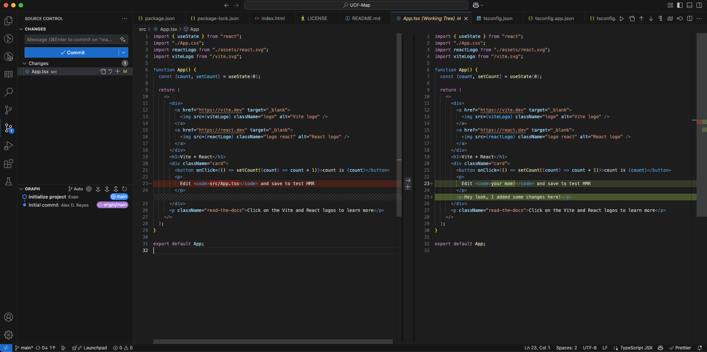
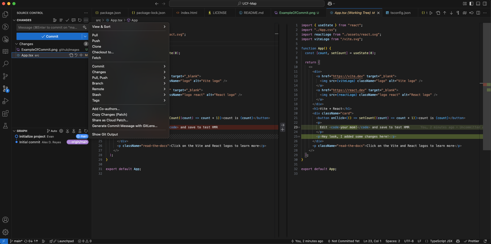

# UCF-Map

UCF Map

# Dev Setup:

To setup the development environment, install the version of node that is located in .nvmrc (Currently this is v20.14.0)

### Step 1:

Make sure you have the correct version of node.

```
node --version
```

You should see: v20.14.0. If you don't have the correct version of node. GET IT! If you install packages you'll probably have to delete the node_modules directory and reinstall everything.

### Step 2:

WHEN YOU HAVE THE CORRECT VERSION OF NODE, install the dependences:

```
npm install
```

### Step 3:

MAKE SURE you are using VS Code and that you have Prettier Installed (`esbenp.prettier-vscode`). If you don't do this, then it will create a lot of problems when you accidentally format someone else's code, completely overwriting their work with your github commit.

### Step 4:

Please look at the guide to contributing below!!!!

You can run the development server with the following command, check it out in your browser.

```
npm run dev
```

# Contributing

Whenever you want to submit ANY changes. Check out what changes you're going to commit by using vscode's source control graphic.

Check EVERY file and scroll through the ENTIRE file to make sure you're not screwing anything up. Write a commit messages describing what you did and then hit commit.

You may need to pull changes before you can sync/push your changes.


## Merge Conflicts

When trying to commit your changes, you may run into a problem where you edited the same file that someone else did, and they pushed their changes before you. Hopefully, everyone is using the same formatter so it won't be whitespace changes screwing up your code.

When you do run into that problem, you can use VS Code's built-in merge conflict resolver. It might be intimidating the first time so [Here's a video](https://youtu.be/lz5OuKzvadQ?si=aB9QrZjR0N-um-8E) I found on it. I'd recommend just learning the "3-way" version but use whatever you like more.

Link to video in plaintext: https://youtu.be/lz5OuKzvadQ?si=aB9QrZjR0N-um-8E
