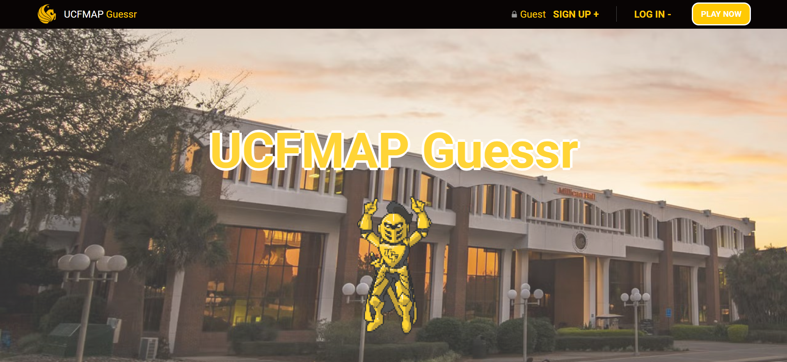

# Welcome To UCF Map Guessr Made With MERN Stack. MongoDB + Express.js + React + Node.js + Nodemon + AWS Lightsail + Leaflet 

Hello Here is the showcase for UCF Map Guessr Project I recently worked on. I worked made the front-end and worked handling the the Leaflet APi.

## Home

 

## Log In

 

  
## Sign Up

 

  
## Create A Guess

 

 
  
## Play Now 

 

✨ Key Features:

  Technologies Used

🔗 View Live Portfolio Demo: https://ucfmap.evanpartidas.com/
